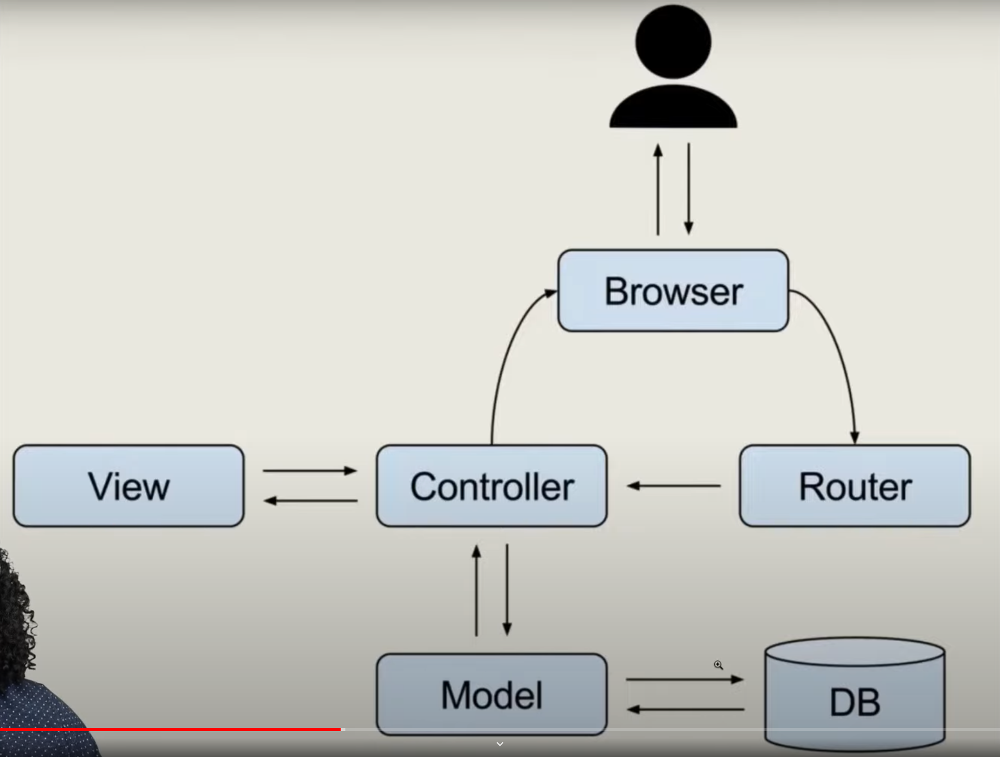

//--- Easy
//create a variable and assign it a number
var num = 15
//minus 10 from that number
var num = num - 10
//print that number to the console
console.log(num)
//--- Medium
//create a variable that holds a value from the input
let varFromInput = Number(document.querySelector('#danceDanceRevolution').value)
let varFromInput2 = Number(document.getElementById('danceDanceRevolution').value)
//add 25 to that number
let varFromInput3 = varFromInput2 + 25
//alert that number
console.log(varFromInput3)
console.log(varFromInput2)
//--- Hard
//create a variable that holds the h1
const h1 = document.querySelector('h1')
const h1x = document.getElementById('h1')
//add an event listener to that element that console logs the sum of the two previous variables
console.log('this is h1',h1, h1x)

const sumOfNum = () => {
  console.log(num + varFromInput)
}
h1.addEventListener('click', sumOfNum)

// or

h1.addEventListener('click', sumOfNum2)

function sumOfNum2() {
  console.log(num+varFromInput3)
}

2:37:11

3:30:00 + 38 networking related advice, template for resume anki? notecards (https://apps.ankiweb.net/)

node backend work should be next video after javascript lesson

5:07:53

lesson 19: 2:26:40

WATCH CLASS ON NETWORKING
CODEWARS

class 23: timestamp 25:52 for contribution instructions

MICROSOFT COGNITIVE API = CHECK IT OUT
REVIEW OBJECTS SHOTS FROM LESSON 26 => get multiple cocktails to list with pictures 

class 27, finish card game by adding scoring system. 

active recall
spaced repitition

https://wesbos.com/javascript/04-the-dom/cardio =>  REVIEW
===========
PHILIP ROBERTS
JAKE ARCHIBALD
Zell Liew
===========
TOPICS FOR NODE^

=================

The bank anki

CRUD = 
create(post) = make something, 
read(get) = get something, 
update(put) = change something, 
delete(delete) = remove something

==================
MVC Model - model view controller
https://developer.mozilla.org/en-US/docs/Glossary/MVC

==================

class 41 @ 2:30:00 -> neccessary parts to allow for personal mongodb atlas access. (instructions also at end of slides for lesson(might be in 44/45))

check mayanwolfe and roofio vods

review ejs - build app with express and mongo db, maybe ejs with it.   

2:16